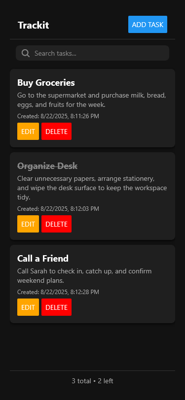
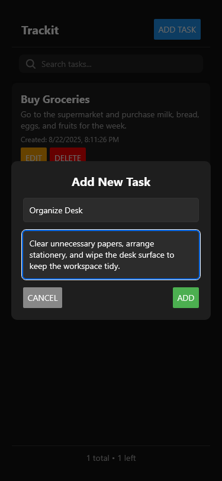
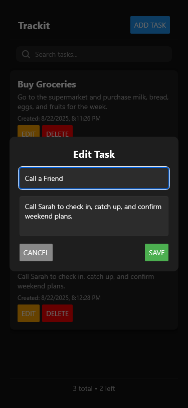

# Trackit (React Native + Expo)

## Objective

This project is a **basic Task Manager app** built with **React Native** and **Expo**.  
The app allows users to:

- Add new tasks
- Mark tasks as complete
- Delete tasks

## Getting Started

### 1. Prerequisites

Make sure you have the following installed:

- [Node.js (LTS recommended)](https://nodejs.org/)
- [Expo CLI](https://docs.expo.dev/get-started/installation/) (optional, you can also use `npx`)
- **Expo Go app** on your iOS or Android device

### 2. Clone the Repository

```bash
git clone <your-repo-url>
cd Trackit
```

### 3. Install Dependencies

```bash
npm install
```

### 4. Run the App

```bash
npm start
```

(or `npx expo start`)

Scan the QR code with the **Expo Go app** to run it on your device.

---

## Features

- **Add Task**: Enter a description and add it to the list.
- **Mark Task as Complete**: Tap a task to toggle its completion state.
- **Delete Task**: Remove a task permanently from the list.
- **Task List**: Displays all tasks, with visual distinction between complete and incomplete ones.

---

## Documentation

### Project Setup

- Expo was used to bootstrap the project for faster development.
- You can also find other templates in the official React Native docs:
  [React Native Quickstart Guide](https://reactnative.dev/docs/environment-setup?guide=quickstart)

### Third-Party Libraries

This project uses **Expo’s built-in libraries** only.
No external UI frameworks were required.

## Project Structure

```
Trackit/
├── app/
│   └── index.tsx                     # Main application logic and state management
│
├── components/
│   ├── AddTaskModal.tsx              # Task creation form
│   └── EditTaskModal.tsx             # Task edit
│
├── types/
│   └── task.ts                       # TypeScript type definitions
│
├── styles/
│   └── styles.ts                     # Shared styling
│
├── assets/
│   ├── fonts/                        # Fonts files
|   ├── images/                       # Images and icons
│   └── preview/                      # Preview files for screenshots
```

---

## Preview




